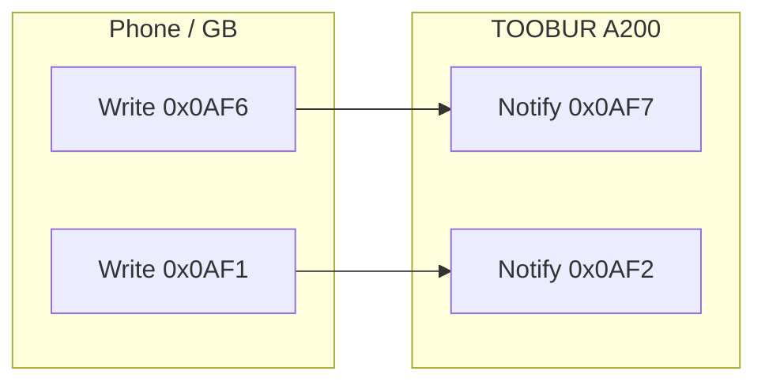

# TOOBUR A200 — Bluetooth protocol reference

> **Canonical source of truth** for this repo.  
> Derived from live **bruteforce probing** on A200 firmware ([`bruteforce_results.txt`](bruteforce_results.txt)), cross-checked with **logcat captures** ([`packetdumps/logcat/`](packetdumps/logcat/)) and the **Gadgetbridge Toobur driver** ([`gadgetbridge/.../toobur/`](gadgetbridge/app/src/main/java/nodomain/freeyourgadget/gadgetbridge/service/devices/toobur/)).  
> Use this document to plan GB improvements ([`issues/README.md`](issues/README.md) — issues **002–032**).  
> External vault notes: [`docs/external-notes/HIVE-A200-NOTES.md`](docs/external-notes/HIVE-A200-NOTES.md) (`/home/dinda/storage/hive/SmartHome/Toobur Veryfit a200`).

---

## How to read this document

| Column | Meaning |
|--------|---------|
| **Probe** | `[VALID]` = watch accepted the command key during bruteforce; `[HUH]` = ambiguous or needs full payload; `[—]` = in VBUS map only, not bruteforced |
| **Verified** | Joint audit status — see [verification log](#feature-verification-log) |
| **GB** | Gadgetbridge Toobur driver today — see [legend](#gadgetbridge-status-legend) |
| **Capture** | Example TX/RX from VeryFit logcat (file name) |
| **Payload** | Known A200 packet shape (not angelfit legacy unless noted) |

### Verification legend

| Mark | Meaning |
|------|---------|
| ⬜ | Not yet audited in this pass |
| 📋 | Capture/bruteforce only — wire bytes documented, not re-tested live this session |
| ✅ | **Verified** — live or capture re-checked; TX/RX shape and behavior confirmed |
| ⚠️ | **Partial** — key ACK or readback OK; full payload / companion cmd not live-tested |
| ⏸ | **Blocked** — skipped (dangerous), needs bind, or needs user action on watch |
| ❌ | **Rejected** — probed live; no valid response on this A200 |

### Gadgetbridge status legend

| Mark | Meaning |
|------|---------|
| ✅ | Wired correctly for A200 |
| ⚠️ | Partial (sync/log only, or missing chart/persist) |
| 🔧 | Wrong payload or legacy path — **fix target** |
| ❌ | Not implemented in GB |
| — | N/A (watch→phone, factory, or out of scope) |

### Evidence hierarchy

1. **This table** (bruteforce + captures + GB cross-check)  
2. [`packetdumps/logcat/*.txt`](packetdumps/logcat/) — ground-truth TX/RX  
3. [`LATEST_SYNC_PARSING.md`](LATEST_SYNC_PARSING.md) — v3 layout & parsers  
4. [`htmlapp/confirmed-only.html`](htmlapp/confirmed-only.html) — live lab tool  
5. [`htmlapp/vbus_mapping.json`](htmlapp/vbus_mapping.json) — VBUS evt ↔ header bytes  

---

## Transport



| GATT | UUID suffix | Role |
|------|-------------|------|
| Service | `0x0AF0` | Realtek / IDO proprietary — **live verified** 2026-06-19 |
| Write | `0x0AF6` | **Normal** — GET, SET, BIND, MSG, APP, v3 HR (`0x09`) |
| Notify | `0x0AF7` | **Normal** replies + live push |
| Write | `0x0AF1` | **Health bulk** — v3 health sync (`0x04`/`0x05`), OTA, watch-face chunks |
| Notify | `0x0AF2` | **Health bulk** replies |

**Live note (2026-06-19):** Unbound probe: classic GET may RX on **`0x0AF2`**. After **BIND `04 01`** + VeryFit prelude, **short v3** frames (1A, 0F, 06, 04/19 B) TX/RX on **`0x0AF6`/`0x0AF7`**; **v3 `0F`** alarms reply is **chunked** (`33…` + `33 00…` continuations). Large **v3 `05`** (137 B) — probe on `0x0AF1` silent; may need ATT chunk on `0x0AF6` (VeryFit `process_tx_buff` splits at MTU). See [`packetdumps/live/2026-06-19_bind-v3.json`](packetdumps/live/2026-06-19_bind-v3.json).

### Top-level command bytes

| Byte | Name | Direction |
|------|------|-----------|
| `0x01` | OTA | Phone → watch |
| `0x02` | GET | Phone → watch |
| `0x03` | SET | Phone → watch |
| `0x04` | BIND | Phone → watch |
| `0x05` | MSG | Phone → watch |
| `0x06` | APP control | Phone → watch |
| `0x07` | BLE control | **Watch → phone** (e.g. data-update notify) |
| `0x08` | Legacy health | Bulk pipe (superseded by v3 on A200) |
| `0x0A` | Weather data | Phone → watch |
| `0x33…` | V3 framed | Preamble `DA AD DA AD` — see [V3](#v3-protocol-0x33) |
| `0xF0` | Reset | Phone → watch |

**Switch convention:** `0xAA` = on, `0x55` = off (most SET toggles).

---

## GET — `0x02` + key

Read requests: TX is typically **`02 [key]`** (2 bytes). Reply on **`0x0AF7`**.

| Key | Name | VBUS evt | Probe | GB | Capture |
|-----|------|----------|-------|-----|---------|
| `01` | Device info | 301 GET_DEVICE_INFO | VALID | ✅ | `get_device_info.txt`, `app_fresh_launch.txt`; **live** `packetdumps/live/2026-06-19_get-device-info.txt` |
| `02` | Func table | 302 GET_FUNC_TABLE | VALID | ✅ | Parsed on connect — `TooburFuncTableCapabilities`; UI gating issue [024](./issues/024-func-table-ui-gating/) closed |
| `03` | Time | — | VALID | ⚠️ | Rarely needed; GB sets time via SET `03 01` |
| `04` | MAC address | 300 GET_MAC | VALID | ✅ | `app_fresh_launch.txt` — RX `02 04 F9 24…` |
| `05` | Battery | 321 GET_BATT_INFO | VALID | ✅ | `02 05` → level %, voltage mV, charge state |
| `07` | Func table ex | 311 GET_FUNC_TABLE_EX | VALID | ✅ | Extended bits parsed — UI gating issue [024](./issues/024-func-table-ui-gating/) closed |
| `10` | Notice status | 306 | VALID | ❌ | Readback for SET `03 30` — issue [025](./issues/025-per-app-notification-switches/) |
| `11` | Unknown | — | VALID | ❌ | — |
| `15` | Exercise settings | 345 | — | ❌ | VBUS only |
| `22` | Units | 342 | — | ❌ | VBUS only |
| `23` | Wear L/R settings | 344 | — | ❌ | VBUS only |
| `30` | DND state | 316 GET_DO_NOT_DISTURB | VALID | ❌ | `set_dnd_on.txt` — RX byte2 `AA`/`55` |
| `31` | Download language | 319 | — | ❌ | VBUS only |
| `32` | Unread app toggle | 351 | — | ❌ | VBUS only |
| `33` | BT notice | 352 | — | ❌ | VBUS only |
| `40` | Error record | 320 | — | ❌ | VBUS only |
| `46` | Other switches | 343 | — | ❌ | VBUS only |
| `48` | Firmware status | 348 | — | ❌ | **Live 2026-06-19:** GET `02 48` — no RX (not on this A200) |
| `59` | Device CMEI | 356 | — | ❌ | — |
| `A0` | Live data | 304 GET_LIVE_DATA | VALID | ✅ | `02 A0` — steps + HR snapshot |
| `A2` | HID info | 310 | — | ❌ | VBUS only |
| `A3`–`A5` | GPS info/status | 312–314 | — | ❌ | No GPS on A200 |
| `A7` | Flash / resource pack | 322 GET_FLASH_BIN_INFO | VALID | ✅ | `get_flashbin_info.txt` |
| `B0` | Bright screen params | — | VALID | ❌ | — |
| `B1` | Weather switch state | 317 area | VALID | ❌ | `set_dnd_on.txt` RX `02 B1 55…` |
| `B2`–`B3` | Unknown | — | VALID | ❌ | — |
| `F0` | MTU / PHY | 317 GET_MTU_INFO | VALID | ✅ | `02 F0` on connect |

---

## SET — `0x03` + key

Settings: **`03 [key] [payload…]`** on **`0x0AF6`**. Payload lengths are **A200-specific** (often longer than angelfit).

### Time, user, goals

| Key | Name | VBUS | Probe | GB | A200 payload (example) |
|-----|------|------|-------|-----|------------------------|
| `01` | Set time | 104 | VALID | ✅ | `03 01 [Y LE] MM DD hh mm ss dow …` (16 B) — `set_time.txt` |
| `03` | Sport step goal | 105 | VALID | ✅ | 17 B — `TooburGoalPackets` (issue [014](./issues/014-goals-set-03-43/)) |
| `04` | Sleep goal | 106 | VALID | ✅ | `03 04 HH MM` — `TooburGoalPackets` |
| `10` | User info | 107 | VALID | ✅ | `TooburConnectSyncPackets` on connect — full GB mapping issue [027](./issues/027-units-user-profile-set-03-11/) |
| `11` | Units / config | 108 | VALID | ✅ | 17 B on connect — imperial/timeformat polish issue [027](./issues/027-units-user-profile-set-03-11/) |
| `12` | Watch dial (legacy) | 124 | VALID | ❌ | Prefer v3 dial cmds |
| `13` | Shortcut | 125 | VALID | ❌ | — |
| `43` | Calorie + distance goals | 161 | VALID | ✅ | `03 43 F4 01…` (20 B) — `TooburGoalPackets` |

### Wear, display, gestures

| Key | Name | VBUS | Probe | GB | A200 payload (example) |
|-----|------|------|-------|-----|------------------------|
| `22` | Wrist L/R | 109 | VALID | ✅ | `03 22 00` left / `01` right |
| `28` | Raise to wake | 114 | VALID | ✅ | `03 28 AA 05 01 00 00 17 3B` (9 B) — `set_hand_gesture_wake_*.txt` |
| `2B` | Screen orientation | 118 | VALID | ✅ | `03 2B 00` horiz / `02` vertical |
| `32` | Auto brightness | 154 | VALID | ✅ | `03 32 28 01 00 03 13 00 06 00 00 05` (12 B) — `set_auto_brightness_*.txt` |

### Alerts, DND, notifications enable

| Key | Name | VBUS | Probe | GB | A200 payload (example) |
|-----|------|------|-------|-----|------------------------|
| `29` | Do not disturb | 116 | VALID | 🔧 | **14 B** + schedule: `03 29 AA 17 00 07 00 02 FE 55…` — GB sends **6 B** only |
| `30` | Call / notice alert | 111 | HUH | 🔧 | **20 B** = 5-field struct + 15× `00` pad — GB sends **5 B** legacy (see [struct](#set-03-30--protocol_set_notice)) |
| `2A` | Music on watch | 117 | VALID | ✅ | **4 B**: `03 2A AA 55` |
| `2D` | Weather push enable | 150 | VALID | ✅ | **6 B**: `03 2D AA 00 00 00`; weather **data** TX → issue 013 |
| `31` | Sleep period | 152 | VALID | ❌ | — |

### Health measurement toggles

| Key | Name | VBUS | Probe | GB | A200 payload (example) |
|-----|------|------|-------|-----|------------------------|
| `24` | HR interval (legacy) | 112 | VALID | — | Superseded by v3 `09` on A200 |
| `25` | HR mode (legacy) | 113 | VALID | ⚠️ | GB still sends for compat; **v3 `09` is primary** |
| `44` | SpO₂ continuous | 162 | VALID | ⚠️ | Full **16 B** schedule: onOff, window, repeat, interval, thresholds, notifyFlag — GB templates flip byte 2 only |
| `45` | Stress / pressure | 163 | VALID | ⚠️ | Full **16 B** schedule + remindOnOff + stressThreshold — GB templates flip byte 2 only — `set_stress_cont_*.txt` |
| `49` | Auto sport detect | 167 | VALID | ✅ | `03 49 01 01 00…` (11 B) — `set_auto_sport_detect_*.txt` |

### Reminders

| Key | Name | VBUS | Probe | GB | A200 payload (example) |
|-----|------|------|-------|-----|------------------------|
| `20` | Long sit | 101 | VALID | ❌ | — |
| `47` | Walk reminder | 165 | VALID | ❌ | `03 47 01 64 00 09 00 15…` (17 B) — `set_walkaround_cont_*.txt` |
| `60` | Drink water | 168 | VALID | ❌ | `03 60 00 09 00 12 00 3E 1E…` (16 B) — `set_drinking_cont_*.txt` |
| `41` | Menstruation data | 159 | VALID | ❌ | `03 41…` — `set_woman_health_remind_*.txt` |
| `42` | Menstruation remind | 160 | VALID | ❌ | `03 42…` — often **42 then 41** in dumps |

### Phone ↔ watch utilities

| Key | Name | VBUS | Probe | GB | A200 payload (example) |
|-----|------|------|-------|-----|------------------------|
| `26` | Find my phone | 103 | VALID | ✅ | `03 26 01 1E` (on + 30 s timeout) |
| `21` | Lost find | 102 | VALID | ❌ | — |
| `27` | Factory default | 115 | VALID | ❌ | Dangerous — do not expose casually |
| `35` | Conn param | 157 | VALID | ✅ | Two-step `03 35 01…` / `03 35 02…` on connect — `TooburConnectSyncPackets` |
| `E3` | Volume keys (deprecated) | — | VALID | ✅ | `03 E3 10 02` on connect — superseded by `07 40` notifyType 32 |
| `52` | Real-time sensor | — | HUH | ❌ | SET `03 52` — purpose **unconfirmed** (hive: accel stream?) |

### Alarms (legacy SET)

| Key | Name | VBUS | Probe | GB | Notes |
|-----|------|------|-------|-----|-------|
| `02` | Set alarm (legacy) | 100 | — | 🔧 | GB uses **7 B × 5 slots** — A200 uses **v3 `0E`/`0F`**, **10 slots** |

---

## BIND — `0x04` + key

| Key | Name | VBUS | Probe | GB | A200 payload (example) |
|-----|------|------|-------|-----|------------------------|
| `01` | Bind start | 200 | HUH | ✅ | **Live 2026-06-19:** `04 01 F1 01 01 02 02 01 00` → `04 01 00 00` after prelude |
| `02` | Unbind | 201 | VALID | ✅ | `04 02 F1 01 01 02 02 01 00` |
| `03` | Auth | 202 | VALID | ❌ | — |
| `05` | Encrypted auth | 204 | HUH | ❌ | — |

---

## MSG — `0x05` + key (notifications & calls)

Phone → watch on **`0x0AF6`**. Chunked UTF-8 for long text.

| Key | Name | VBUS | Probe | GB | Format |
|-----|------|------|-------|-----|--------|
| `01` | Incoming call | — | VALID | ✅ | `05 01 [totalChunks] [idx] [16 B payload]…` — `SendNotificationOperation` |
| `02` | Call status / end | 412, 420 | VALID | ✅ | `05 02 01` stop — `ID115Support.sendStopCallNotification()` |
| `03` | Message / notification | — | VALID | ✅ | `05 03 [totalChunks] [idx] [16 B payload]…` |
| `05` | Call duration | 415 | — | ❌ | VBUS only |
| `06` | Quick reply toggle | 194 | — | ❌ | VBUS only |

**Message center:** no separate command — inbox is stored **MSG `05 03`** payloads on the watch.

**Answer call from watch:** watch → phone via **`0x07`** BLE events, not MSG — GB not wired.

---

## APP control — `0x06` + key

| Key | Name | VBUS | Probe | GB | Payload |
|-----|------|------|-------|-----|---------|
| `01` | Music play/pause | 500–501 | VALID | ✅ | `06 01 00` play / `01` pause |
| `02` | Camera shutter | 502–503 | VALID | ❌ | — |
| `03` | Single sport | — | VALID | ❌ | — |
| `04` | Find device | 504–505 | VALID | ✅ | `06 04 00` start / `01` stop |
| `30` | Open ANCS | 506 | VALID | ❌ | iOS path |
| `31` | Close ANCS | — | VALID | ❌ | — |

---

## BLE control — `0x07` (watch → phone)

Watch initiates on notify **`0x0AF7`**. Phone must **ACK** (often mirror `07 40…` back) before optional GET readbacks.

### `07 40` — data-update notify (evt 577)

**notifyType** bitmask (IDO GitBook — phone may GET readback after ACK):

| Bit | Value | Meaning | Typical readback |
|-----|-------|---------|------------------|
| 0 | 1 | Alarm modified | — |
| 1 | 2 | Overheat | — |
| 2 | 4 | Brightness changed | GET `02 B0` |
| 3 | 8 | Raise-wrist changed | GET `02 B1` |
| 4 | 16 | DND / refresh | GET `02 30` |
| 5 | 32 | Volume (deprecated) | SET `03 E3` |

Example: after SET DND → `RX : 07 40 00 00 10 00 …` → phone `TX : 07 40 …` → GET `02 30`.

### Control events (evt 551–591)

Map incoming `07 01` / `07 02` sub-packets to Android actions via `TooburSupport.dispatchWatchAction()`:

| Evt | Wire (`07 01` cmd1) | GB action |
|-----|---------------------|-----------|
| 551–555 | 1–5 | Music play / pause / prev / next |
| 556–561 | — | Camera (not wired) |
| **562** | 12 | **Answer phone call** |
| **563** | 13 | **Reject phone call** |
| 570 / 572 | `07 02` / — | Find phone start (GB `GBDeviceEventFindPhone`) |
| 578 | — | Version check (not wired) |
| 579 | — | OTA request (not wired) |
| 580 | — | SMS info (not wired) |

| Key | Name | Probe | GB | Notes |
|-----|------|-------|-----|-------|
| `40` | Data updated notify | VALID | ✅ | ACK + GET readback by notifyType — `TooburBleEventPackets` |
| `01` | Control evt | — | ✅ | Music prev/next + call reject/accept — IDO `protocol_cmd.cmd1` |
| `02` | Find phone | — | ✅ | `GBDeviceEventFindPhone.START` |
| `03` | SOS | — | ❌ | VBUS |

---

### SET `03 30` — `protocol_set_notice`

5-byte struct + **15 bytes zero padding** = 20 B total (`03 30` + 20 B payload).

| Offset | Field | Example | Notes |
|--------|-------|---------|-------|
| 0 | `notify_switch` | `0x88` | Master notice mode (not simple 0/1) |
| 1 | `notify_item1` | `0x00` | Per-app bitmask 1 — see func table notify bits |
| 2 | `notify_item2` | `0x00` | Per-app bitmask 2 |
| 3 | `call_switch` | `0xAA` | Incoming call alert |
| 4 | `call_delay` | `0x00` | Delay seconds |
| 5–19 | padding | `0x00` | Required on A200 |

ACK reply echoes `notify_switch` + `status_code` + `err_code`. GET readback: **`02 10`**. Issues: [003](./issues/003-fix-set-03-30-notice-alert/), [025](./issues/025-per-app-notification-switches/).

---

## Weather — `0x0A` + key

| Key | Name | VBUS | Probe | GB | Notes |
|-----|------|------|-------|-----|-------|
| `01` | Weather payload | 153 | VALID | ✅ | **18 B**: `0A 01` + 16 B forecast; SET `03 2D` enable first — `set_push_weather_on.txt` |
| `02` | City name | 6500 | — | ✅ | **20 B**: `0A 02` len + UTF-8 (padded) — follows `0A 01` in capture |
| `6C` | Unknown | — | VALID | ❌ | Bruteforce only |

---

## Reset — `0xF0` + key

| Key | Name | VBUS | Probe | GB | Notes |
|-----|------|------|-------|-----|-------|
| `01` | Reboot | 403 | VALID | ✅ | `F0 01` |
| `02` | Unknown | — | VALID | ❌ | — |
| `03` | Shutdown | 406 | VALID | ⚠️ | `F0 03` — ID115 power off path |

---

## V3 protocol (`0x33`)

Framed packets: **`33 DA AD DA AD 01 [len LE] [cmd LE] [seq LE] [payload…] [CRC16]`**.  
Large payloads chunk on **`0x0AF1`** → notify **`0x0AF2`**. Continuation headers: `33 00 00…`.

Spec detail: [`LATEST_SYNC_PARSING.md`](LATEST_SYNC_PARSING.md).

### V3 commands (bruteforce-valid on A200)

| Cmd | Name | Probe | GB | Role |
|-----|------|-------|-----|------|
| `04` | Health sync | VALID | ✅ | START/STOP per **data type** — see table below |
| `05` | Health sizes | VALID | ✅ | Offset probe before sync — 7 types in one request |
| `06` | Get dial list | VALID | ❌ | List installed faces — `ui_select_watch_face.txt` |
| `07` | Write dial metadata | VALID | ❌ | JSON/metadata before bulk upload |
| `08` | Set active dial | VALID | ❌ | Select face already on watch |
| `09` | HR continuous mode | VALID | ✅ | **Live 2026-06-19** — single 26 B frame on **`0x0AF6`**; see [v3 cmd `09`](#v3-cmd-09--continuous-hr-schedule) |
| `0E` | Set alarms (+ sport order) | VALID | 🔧 | **355 B**, 10 slots — GB uses legacy SET `03 02` |
| `0F` | Get alarms | VALID | ❌ | `get_alarm.txt` |
| `10` | Fast message | VALID | ❌ | — |
| `1A` | Func table v3 | VALID | ✅ | GET on connect; parsed — issue [024](./issues/024-func-table-ui-gating/) closed |
| `12`–`14`, `31` | Misc / sport | VALID | ❌ | — |

### V3 health sync data types (`0x04` / `0x05`)

Order used by VeryFit and GB (`TooburV3HealthSync.V3_HEALTH_SYNC_DATA_TYPES`):

| Type | Metric | byte14 on `04` | GB fetch | GB persist / chart |
|------|--------|----------------|----------|-------------------|
| `01` | SpO₂ day | `01` | ✅ | ✅ SpO₂ chart |
| `02` | Stress / pressure day | `01` | ✅ | ✅ Stress chart |
| `03` | HR day series | `01` | ✅ | ⚠️ parsed, not stored |
| `04` | Activity / **workout records** | `00` | ✅ | ✅ |
| `06` | Swim sessions | `00` | ✅ | ✅ |
| `07` | **Sleep** | `00` | ✅ | ❌ — **priority fix** |
| `08` | Daily sport summary (steps, kcal, distance) | `01` | ✅ | ✅ Activity sample |

**Not present on A200 v3 health sync:** blood sugar, weight, VO2Max, menstrual **data** (reminders are SET `41`/`42`, not sync types).

### v3 cmd `09` — continuous HR schedule

**Purpose:** tell the watch *whether* and *how often* to measure HR continuously. **Does not return HR samples** — use [HR data fetch](#hr-data-how-to-read-measurements) below.

**Wire:** one **26-byte** frame on **`0x0AF6`** (notify ack on **`0x0AF7`**). VBUS evt **5010** (`VBUS_EVT_FUNC_V3_SET_HR_MODE`).

**Payload** (bytes 12–23 after `33 DA AD DA AD 01 17 00 09 00 [seq LE]`):

| Field | Size | OFF example | ON example | Notes |
|-------|------|-------------|------------|-------|
| `updateTime` | 4 LE | `0E 3B BD 69` | `11 3B BD 69` | Unix timestamp (seconds) |
| `state` | 2 | **`AA 00`** | **`CC 00`** | **Not** `99`/`55` — old captures/app toggle were wrong |
| `timeStartEnd` | 4 | `00 00 00 00` | `00 00 00 00` | All-day / null window in tested config |
| `measureInterval` | 2 LE | `2C 01` (=300) | `2C 01` | Seconds; see valid set below |

**Valid `measureInterval` (seconds):** `5`, `60`, `180`, `300`, `600`, `900`, `1800`, **`255`** = smart / dynamic HR.  
**Invalid:** e.g. `10` — watch snaps to another interval (~60 s observed).  
**RX ack:** `33…09…` inner len `1F 00`; echoes `state` + `interval`; trailing `04 00 00 00` status.

**Example (user live test 2026-03-20):**

```
TX OFF: 33 DA AD DA AD 01 17 00 09 00 8C 03  0E 3B BD 69  AA 00  00 00 00 00  2C 01  …
RX OFF: 33 DA AD DA AD 01 1F 00 09 00 8C 03  00 00 00 00  AA 00  00 00 00 00  2C 01  00 00 00 00  04 00 00 00 …

TX ON:  33 DA AD DA AD 01 17 00 09 00 8D 03  11 3B BD 69  CC 00  00 00 00 00  2C 01  …
RX ON:  … CC 00 … 2C 01 … 04 00 00 00
```

GB builder: `TooburV3HrPackets.buildHrUnified()` — same layout. Legacy SET `03 25` is redundant on A200.

### HR data — how to read measurements

| Need | Command | Notes |
|------|---------|-------|
| **Latest HR bpm** | GET `02 A0` | Live snapshot; byte 18 = `lastKnownHrm` after header |
| **Day HR history** | v3 `05` (sizes) → v3 `04` **START** type **`03`** → STOP | Time series stored on watch at the `09` interval; **live-verified** after bind ([`2026-06-19_bind-v3.json`](packetdumps/live/2026-06-19_bind-v3.json)) |
| **Parse layout** | — | [`LATEST_SYNC_PARSING.md`](LATEST_SYNC_PARSING.md), `TooburV3HrParser`, `htmlapp/toobur-hr-csv.html` |

There is **no** per-beat BLE notify while continuous HR runs — the band records locally, then the phone **pulls** via `02 A0` (spot) or v3 type `03` sync (chart/history). Smart mode (`255`) uses the same fetch paths; only the watch-side sampling policy changes.

---

## Feature verification log

Systematic joint audit of every capability we believe the A200 has.  
**Batch live run 2026-06-19:** 72 probes, 54 OK on `0x0AF6` classic path — full log [`packetdumps/live/2026-06-19_batch-audit.json`](packetdumps/live/2026-06-19_batch-audit.json).  
**Bind + v3 run 2026-06-19:** VeryFit prelude + `BIND 04 01` → **22/23 OK** — [`packetdumps/live/2026-06-19_bind-v3.json`](packetdumps/live/2026-06-19_bind-v3.json). Short v3 on **`0x0AF6`/`0x0AF7`** after bind; only **v3 `05`** (137 B on `0x0AF1`) still silent.

| # | Feature | Wire | Verified | Evidence | Notes |
|---|---------|------|----------|----------|-------|
| 1 | GATT transport | `0x0AF0` svc, `0x0AF6`/`0x0AF7`, `0x0AF1`/`0x0AF2` | ✅ | `packetdumps/live/2026-06-19_gatt-transport.txt` | GATT + smoke GET 02 05 |
| 2 | Device info | GET `02 01` | ✅ | `packetdumps/live/2026-06-19_get-device-info.txt` | deviceId=532 fw=17 |
| 3 | Battery | GET `02 05` | ✅ | `packetdumps/live/2026-06-19_batch-audit.json` | GET 02 05 ACK |
| 4 | Func table (base) | GET `02 02` | ✅ | `packetdumps/live/2026-06-19_batch-audit.json` | GET 02 02 |
| 5 | Func table (ex) | GET `02 07` | ✅ | `packetdumps/live/2026-06-19_batch-audit.json` | GET 02 07 |
| 6 | Set time | SET `03 01` | ⏸ | `set_time.txt` | not live-tested — changes clock |
| 7 | MTU / PHY | GET `02 F0` | ✅ | `packetdumps/live/2026-06-19_batch-audit.json` | GET 02 F0 MTU=137 |
| 8 | Bind / unbind | BIND `04 01`/`02` | ✅ | `packetdumps/live/2026-06-19_bind-v3.json` | BIND 04 01 → RX 04 01 00 00 |
| 9 | Live steps + HR snapshot | GET `02 A0` | ✅ | `packetdumps/live/2026-06-19_batch-audit.json` | GET 02 A0 |
| 10 | Daily sport summary sync | v3 type `08` | ✅ | `packetdumps/live/2026-06-19_bind-v3.json` | v3 type 08 start/stop after bind |
| 11 | HR day history | v3 type `03` | ✅ | `packetdumps/live/2026-06-19_bind-v3.json` | v3 type 03 start/stop |
| 12 | HR continuous schedule | v3 `09` + SET `25` | ✅ | user live 2026-03-20 + `TooburV3HrPackets` | CC/AA toggle + intervals 5…1800, 255 smart |
| 13 | SpO₂ day sync | v3 type `01` | ✅ | `packetdumps/live/2026-06-19_bind-v3.json` | v3 type 01 SpO₂ start/stop |
| 14 | SpO₂ continuous toggle | SET `03 44` | ⚠️ | `packetdumps/live/2026-06-19_batch-audit.json` | SET 03 44 key ACK; 16 B schedule not sent |
| 15 | Stress day sync | v3 type `02` | ✅ | `packetdumps/live/2026-06-19_bind-v3.json` | v3 type 02 stress start/stop |
| 16 | Stress continuous toggle | SET `03 45` | ⚠️ | `packetdumps/live/2026-06-19_batch-audit.json` | SET 03 45 key ACK; 16 B schedule not sent |
| 17 | Sleep sync | v3 type `07` | ✅ | `packetdumps/live/2026-06-19_bind-v3.json` | v3 type 07 sleep start/stop |
| 18 | Workout sessions | v3 type `04` | ✅ | `packetdumps/live/2026-06-19_bind-v3.json` | v3 type 04 workouts start/stop |
| 19 | Swim sessions | v3 type `06` | ✅ | `packetdumps/live/2026-06-19_bind-v3.json` | v3 type 06 swim start/stop |
| 20 | Health sync offsets | v3 `05` | ⚠️ | `packetdumps/live/2026-06-19_bind-v3.json` | v3 05 on 0AF1 silent — needs 0AF6 chunk or bind+MTU |
| 21 | Alarms get | v3 `0F` | ✅ | `packetdumps/live/2026-06-19_bind-v3.json` | v3 0F alarms — chunked RX on 0AF7 |
| 22 | Alarms set | v3 `0E` | ⏸ | `set_alarms_and_sports.txt` | v3 0E 355 B not sent |
| 23 | Sport step goal | SET `03 03` | ✅ | `packetdumps/live/2026-06-19_batch-audit.json` | SET 03 03 key ACK |
| 24 | Calorie + distance goals | SET `03 43` | ✅ | `packetdumps/live/2026-06-19_batch-audit.json` | SET 03 43 key ACK |
| 25 | Sleep goal | SET `03 04` | ✅ | `packetdumps/live/2026-06-19_batch-audit.json` | SET 03 04 key ACK |
| 26 | User profile | SET `03 10` | ✅ | `packetdumps/live/2026-06-19_batch-audit.json` | SET 03 10 key ACK |
| 27 | Units / locale | SET `03 11` | ✅ | `packetdumps/live/2026-06-19_batch-audit.json` | SET 03 11 key ACK |
| 28 | Wrist L/R | SET `03 22` | ✅ | `packetdumps/live/2026-06-19_batch-audit.json` | SET 03 22 key ACK |
| 29 | Raise to wake | SET `03 28` | ✅ | `packetdumps/live/2026-06-19_batch-audit.json` | SET 03 28 key ACK |
| 30 | Screen orientation | SET `03 2B` | ✅ | `packetdumps/live/2026-06-19_batch-audit.json` | SET 03 2B key ACK |
| 31 | Do not disturb | SET `03 29` + GET `02 30` | ✅ | `packetdumps/live/2026-06-19_batch-audit.json` | GET 02 30 + SET 03 29 + 07 40 notify |
| 32 | Call / notice alert | SET `03 30` + GET `02 10` | ⚠️ | `packetdumps/live/2026-06-19_batch-audit.json` | GET 02 10 OK; SET 03 30 20 B not sent |
| 33 | Music on watch toggle | SET `03 2A` | ✅ | `packetdumps/live/2026-06-19_batch-audit.json` | SET 03 2A 4 B ACK |
| 34 | Weather push enable | SET `03 2D` | ✅ | `packetdumps/live/2026-06-19_batch-audit.json` | GET 02 B1 + SET 03 2D 6 B |
| 35 | Weather data | `0A 01` + `0A 02` city | ✅ | `packetdumps/logcat/set_push_weather_on.txt` | 18 B forecast + 20 B city; GET 02 B1 after SET 2D |
| 36 | Notifications | MSG `05 03` | ✅ | `packetdumps/live/2026-06-19_batch-audit.json` | MSG 05 03 1-chunk |
| 37 | Incoming call | MSG `05 01` | ⏸ | `—` | MSG 05 01 not sent — would ring watch |
| 38 | Call end | MSG `05 02` | ✅ | `packetdumps/live/2026-06-19_batch-audit.json` | MSG 05 02 |
| 39 | Music control (phone) | APP `06 01` | ✅ | `packetdumps/live/2026-06-19_batch-audit.json` | APP 06 01 |
| 40 | Find device | APP `06 04` | ✅ | `packetdumps/live/2026-06-19_batch-audit.json` | APP 06 04 start/stop |
| 41 | Find my phone | SET `03 26` | ✅ | `packetdumps/live/2026-06-19_batch-audit.json` | SET 03 26 key ACK |
| 42 | Auto sport detect | SET `03 49` | ✅ | `packetdumps/live/2026-06-19_batch-audit.json` | SET 03 49 |
| 43 | Auto brightness | SET `03 32` | ✅ | `packetdumps/live/2026-06-19_batch-audit.json` | SET 03 32 + 07 40 notify |
| 44 | Walk reminder | SET `03 47` | ✅ | `packetdumps/live/2026-06-19_batch-audit.json` | SET 03 47 key ACK |
| 45 | Drink water reminder | SET `03 60` | ✅ | `packetdumps/live/2026-06-19_batch-audit.json` | SET 03 60 key ACK |
| 46 | Menstruation data + remind | SET `03 41`/`42` | ✅ | `packetdumps/live/2026-06-19_batch-audit.json` | SET 03 41/42 key ACK |
| 47 | Long sit reminder | SET `03 20` | ✅ | `packetdumps/live/2026-06-19_batch-audit.json` | SET 03 20 key ACK |
| 48 | Watch face list | v3 `06` | ✅ | `packetdumps/live/2026-06-19_bind-v3.json` | v3 06 dial list |
| 49 | Watch face set active | v3 `08` | ⏸ | `ui_select_watch_face.txt` | v3 08 not probed live |
| 50 | Watch face upload | v3 `07` + bulk | ⏸ | `ui_watch_face_write_json.txt` | v3 07 + bulk not probed |
| 51 | BLE data-update notify | `07 40` | ✅ | `packetdumps/logcat/set_dnd_on.txt` | ACK 18 B + GET 02 30/ B1/ B0 by notifyType |
| 52 | Answer / reject call (watch) | `07` evt 562/563 | ⏸ | `—` | needs incoming call on watch |
| 53 | Watch music / camera keys | `07` evt 551–561 | ⏸ | `—` | press watch music/camera buttons |
| 54 | MAC address | GET `02 04` | ✅ | `packetdumps/live/2026-06-19_batch-audit.json` | GET 02 04 F9:24:12:2E:0C:32 |
| 55 | Flash / resource info | GET `02 A7` | ✅ | `packetdumps/live/2026-06-19_batch-audit.json` | GET 02 A7 |
| 56 | Firmware status | GET `02 48` | ❌ | `packetdumps/live/2026-06-19_batch-audit.json` | GET 02 48 — no RX on A200 |
| 57 | Reboot / shutdown | `F0 01`/`03` | ⏸ | `—` | F0 01/03 skipped |
| 58 | OTA firmware | `01` + bulk | ⏸ | `—` | OTA not attempted |
| 59 | Camera shutter (phone) | APP `06 02` | ⏸ | `—` | APP 06 02 not sent |
| 60 | Conn param tune | SET `03 35` | ✅ | `packetdumps/live/2026-06-19_batch-audit.json` | SET 03 35 step 01 ACK |

**Audit progress:** 43 verified · 4 partial · 12 blocked · 1 rejected

---

## Feature checklist → protocol map

Your Gadgetbridge wish list mapped to this reference:

| Feature | Protocol | GB | Issue priority |
|---------|----------|-----|----------------|
| Alarms get/set | v3 `0F` / `0E` | 🔧 | **P0** |
| Sleep sync | v3 type `07` | ⚠️ | **P0** |
| Steps / calories / distance | v3 type `08` + GET `A0` | ✅ / ⚠️ | P1 polish |
| Workout sessions | v3 type `04` | ✅ | P1 |
| HR history | v3 type `03` + v3 `09` | ✅ / ⚠️ | chart [007](./issues/007-hr-day-v3-type-03/) closed; schedule [026](./issues/026-v3-hr-09-full-schedule/) |
| SpO₂ / stress | v3 `01`/`02` + SET `44`/`45` | ⚠️ | P2 — full schedule [023](./issues/023-spo2-stress-full-set-payloads/) |
| Sport / sleep / calorie goals | SET `03`/`04`/`43` | ✅ | issue [014](./issues/014-goals-set-03-43/) closed |
| Notifications | MSG `05 03` | ✅ | Fixture: `TooburMsgPacketsTest` (issue [011](./issues/011-notifications-msg-verify/)) |
| Message center | MSG `05 03` | ✅ | Same wire as notify — issue [011](./issues/011-notifications-msg-verify/) |
| Calls + dismiss | MSG `05 01`/`02` | ✅ | TX fixtures issue [011](./issues/011-notifications-msg-verify/); answer/reject watch `07` — ❌ [017](./issues/017-watch-ble-events-07/) |
| Wrist L/R | SET `22` | ✅ | — |
| Battery | GET `05` | ✅ | — |
| Bind | BIND `04 01`/`02` | ✅ | Manual only |
| Watch face | v3 `06`/`07`/`08` + bulk | ❌ | P3 |
| HR / stress / drink / walk / menstrual toggles | SET `45`/`44`/`60`/`47`/`41`/`42` | partial | P2 |
| Auto sport | SET `49` | ✅ | — |
| Music | SET `2A` + APP `01` | ✅ / ✅ | — |
| Weather | SET `2D` + `0A 01` data + `0A 02` city | ✅ | issue 013 closed |
| DND schedule | SET `29` + GET `30` | 🔧 | **P0** |
| Raise to wake | SET `28` | ✅ | — |
| Find phone / find device | SET `26` / APP `04` | ✅ | — |
| Auto brightness schedule | SET `32` | ✅ | issue 016 |
| Device language | GET `31`? | ❌ | Unconfirmed |
| Time / restart | SET `01` / `F0 01` | ✅ | — |
| Firmware update | OTA `01` + bulk | ❌ | P3 |
| Device info full | GET `01`/`04`/`A7`/`48`/`F0` | partial | P1 |
| Health sync offsets | v3 `05` per-type u32 | ✅ | Connect auto-fetch when v3 `1A` auto-sync bit set (issue 028) |

---

## GB improvement backlog (from this reference)

Ordered fixes derived from **🔧** and **❌** rows above:

### P0 — wrong wire or high daily impact

1. **SET `03 30`** — 20-byte call/notice alert (`app_fresh_launch.txt`)
2. **SET `03 29`** — 14-byte DND + schedule + GET `02 30` readback
3. **v3 alarms `0E`/`0F`** — replace SET `03 02`; 10 slots
4. **Sleep v3 type `07`** — parser + GB sleep chart

### P1 — charts & info

5. **HR day v3 type `03`** — persist + HR chart  
6. **Workouts v3 type `04`** — ActivitySummary  
7. **GET `02 04` MAC, `02 A7` flash** — device card  
8. **MSG verify** — confirm chunked notify on A200 with fixture tests  

### P2 — settings from captures

9. SET `32` brightness, `43` goals, `60`/`47`/`41`/`42` reminders  
10. SET `2A`/`2D` payload length fix + weather **`0A 01`** payload  
11. Swim v3 type `06`  

### P3 — Phase C

12. Watch face v3 + bulk OTA path  
13. Firmware status GET `48`, OTA `01`  

---

## Appendix A — Valid but out of scope

Factory / test commands from bruteforce (`0xAA…`, many `0xAB…`, `F3 xx` disconnect probes). **Do not** expose in Gadgetbridge user UI.

## Appendix B — VBUS-only keys (not bruteforced)

See **`MISSING_FROM_BRUTEFORCE_RESULTS`** section in [`bruteforce_results.txt`](bruteforce_results.txt) — present in [`vbus_mapping.json`](htmlapp/vbus_mapping.json) but not probe-validated on your A200. Treat as **unconfirmed** until captured.

## Appendix C — Func table (A200 snapshot)

From hive vault parse of this watch — use for UI gating ([issue 024](./issues/024-func-table-ui-gating/)):

| Table | Notable bits set |
|-------|------------------|
| Base `02 02` | stepCalculation, sleepMonitor, heartRate, exFuncTable, weather, v3_function_table, calling+contact+num |
| Ex `02 07` | v3_hr_data, v3_swim, v3_sleep, v3_sync_alarm, drink_water_reminder, night_auto_brightness, multi_dial |
| v3 `1A` | automatic_sync_v3_health_data, pressure_add_notify_flag_and_mode_03_45 |

Full 42-table bit map: external vault `FuncTables.md` + repo `func-tables/function_table.json`.

Example device info: `deviceId=532`, `firmwareVersion=17`, `gps_platform=0`.

## Appendix D — Document maintenance

| When | Action |
|------|--------|
| Feature verified in joint audit | Set **Verified** in [log](#feature-verification-log) + matching table row; bump progress counter |
| New logcat capture | Update **Capture** column + example hex in this file |
| GB ships a feature | Update **GB** column |
| Bruteforce re-run | Sync from `bruteforce_results.txt` |
| Hive vault update | Merge into this file + [`HIVE-A200-NOTES.md`](docs/external-notes/HIVE-A200-NOTES.md) |
| New confirmed test | Link test class in [`issues/`](issues/) issue + `docs/confirmed-features.md` |

**Superseded for wire truth:** duplicate command tables in `TOOBUR.md`, `README.md` feature lists — link here instead.

---

*Last consolidated: 2026-06-19 — sources: `bruteforce_results.txt`, `packetdumps/logcat/`, Gadgetbridge Toobur driver, hive vault.*
